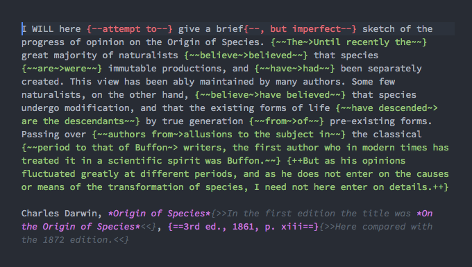

# atom-criticmarkup

### About
Forked from [jnmaloof](https://github.com/jnmaloof/critic-markup), who forked [lodestone](https://github.com/lodestone/critic-markup), who forked [claman](https://github.com/claman/), who ported the CriticMarkup Textmate bundle to Atom – but unfortunately removed the package from his own repository, although it remains listed among available [Atom packages](https://atom.io/packages/). This iteration fills the gap and suits my needs.

[Critic Markup](http://criticmarkup.com/) is a way for authors and collaborators to track changes in plain-text [Markdown](https://en.wikipedia.org/wiki/Markdown) documents.



### Install
From a terminal in this directory, you can link the package to your Atom folder by running `apm link`.

### To-dos/Wish-list
Wouldn't it be nice to be able to remove the markup when selecting a text already marked up? If you implement this, please let me know.

### Keybindings
I am using the following, to avoid conflict with some MacOS default shortcuts.
```
"ctrl-shift-a": "critic-markup:addition"
"ctrl-shift-d": "critic-markup:deletion"
"ctrl-shift-s": "critic-markup:substitution"
"ctrl-shift-h": "critic-markup:highlight"
"ctrl-shift-c": "critic-markup:comment"
```
